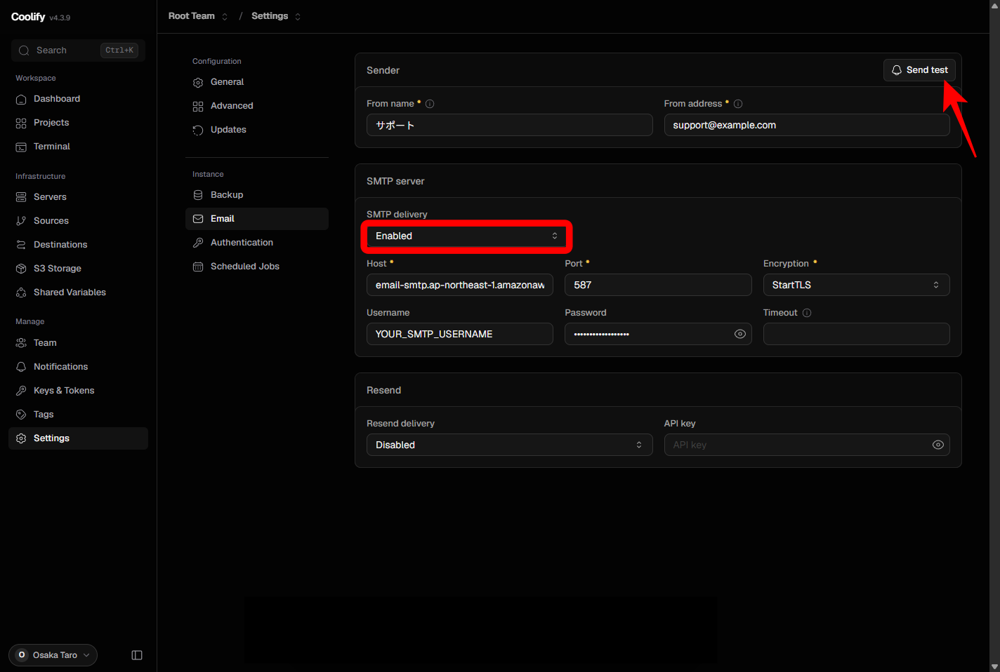

[[guides/coolify/installation|Coolify のインストール]] が完了していることを確認してから、以下の手順に進みます。

このページでは、管理画面の **Settings → Email** で Coolify のメール送信（SMTP）を設定します。

ここで設定するのは **Coolify 本体が送るメール** です。WordPress など、デプロイしたアプリのメール送信には使えません。アプリ側はそれぞれ別途 SMTP を設定してください。メールを受信するための設定ではありません。

## 設定するとできること

- **パスワード再設定** — ログイン画面の Forgot password からリセット用メールを送れるようになります。SMTP を設定していないとメールは届きません
- **チーム招待** — メンバーをメールで招待できます（リンクを発行するだけの運用もできますが、メールで送るにはこの設定が必要です）
- **送信テスト** — SMTP を有効にすると **Send test** ボタンが表示されます。テストメールを送り、届くかどうかを確認できます

ここで設定した SMTP は、あとから **Notifications → Email** の **Use system wide (transactional) email settings** に流用できます。デプロイ失敗やバックアップ失敗などの運用通知も、同じ送信経路で送れます。通知の詳細な手順は、このページでは扱いません。

## 前提条件

- [[guides/coolify/installation|Coolify のインストールと初期設定]] が完了し、管理画面にログインできる
- SMTP プロバイダの接続情報が手元にある（Host、Port、暗号化方式、ユーザー名、パスワード）

Gmail のアプリパスワード、Amazon SES、Brevo、SendGrid など、既存のメール配信サービスを利用します。このガイドでは自前のメールサーバーは扱いません。

## 1. Email 設定画面を開く

1. 管理画面の左メニューで **Settings** をクリックします。
2. **Email** ページを開きます。

画面例の Host（`email-smtp.ap-northeast-1.amazonaws.com`）は Amazon SES の設定例です。利用するプロバイダの管理画面に表示された値を入力してください。

## 2. 差出人（Sender）を設定する

**From name** と **From address** を入力し、Sender の **Save** で保存します。

| 項目 | 内容 |
| :-- | :-- |
| **From name** | 受信箱に表示される差出人名（例: `サポート`） |
| **From address** | 差出人のメールアドレス（例: `support@example.com`） |

From address は、SMTP プロバイダが送信を許可しているアドレスにしてください。許可されていないアドレスを指定すると、テストメールは届きません。

**Send test** は、この時点ではまだ表示されません。SMTP を有効にして正常に保存されると表示されます。

## 3. SMTP の接続情報を入力する

**SMTP delivery** は、最初は **Disabled** のままにしておきます。接続情報を入力してから Enabled に切り替えます。

:::caution
接続情報が空のまま **SMTP delivery** を **Enabled** にすると、保存に失敗して Disabled に戻ることがあります。Host や Port などを先に入力してください。
:::

1. 次の項目を入力します。この時点では **SMTP delivery** は **Disabled** のままです。

   | 項目 | 内容 |
   | :-- | :-- |
   | **Host** | SMTP サーバーのホスト名（プロバイダから提供された値） |
   | **Port** | SMTP のポート番号 |
   | **Encryption** | 暗号化方式 |
   | **Username** | SMTP 認証のユーザー名 |
   | **Password** | SMTP 認証のパスワード |
   | **Timeout** | 任意。空のままで構いません |

   よく使う Port と Encryption の組み合わせは次のとおりです。

   | Port | Encryption | 備考 |
   | :-- | :-- | :-- |
   | **587** | **StartTLS** | 最も一般的な組み合わせ |
   | **465** | **TLS/SSL** | 接続時から暗号化される |
   | — | **None** | 暗号化されないため非推奨 |

2. SMTP セクションの **Save** をクリックします。
3. **SMTP delivery** を **Enabled** に切り替えます。切り替えると同時に保存されます。

同じページの **Resend** は、SMTP の代わりに Resend の API で送る設定です。SMTP を使う場合は **Resend delivery** を **Disabled** のままにしてください。

## 4. Send test で送信を確認する

SMTP delivery を Enabled にして正常に保存されると、Sender 右上に **Send test** ボタンが表示されます（上の画面の赤矢印）。SMTP を有効にする前は表示されません。

1. **Send test** をクリックします。
2. 表示された **Recipient**（宛先）を確認します。初期値には、**現在ログインしている Coolify ユーザーのメールアドレス**（インストール時に登録した Email）が入力されています。Sender の From address ではありません。
3. 別のアドレスで確認したい場合は、Recipient を書き換えてから送信します。
4. 宛先の受信箱にテストメールが届いたら、設定は完了です。届かないときは迷惑メールフォルダも確認してください。

**Send test** が表示されない場合は、SMTP delivery が Disabled に戻っていないか、Sender と接続情報が保存されているかを確認してください。

## トラブルシューティング

| 症状 | 確認すること |
| :-- | :-- |
| Enabled にしてもすぐに Disabled に戻る／Send test が表示されない | 接続情報を先に入力・保存してから Enabled にしたか。From name / From address が入力されているか |
| テストメールが届かない | Username / Password が正しいか。From address がプロバイダで許可されているか。迷惑メールフォルダに振り分けられていないか |
| 送信そのものが失敗する | VPS によっては 25 番ポートの送信がブロックされます。587 または 465 を使ってください |

## 次のステップ

[[guides/wordpress/installation|WordPress のインストール]] で、Coolify の基本操作（デプロイ、ドメイン、SSL）を学びましょう。
