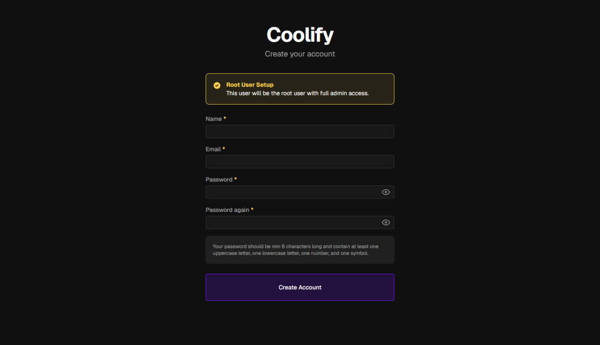
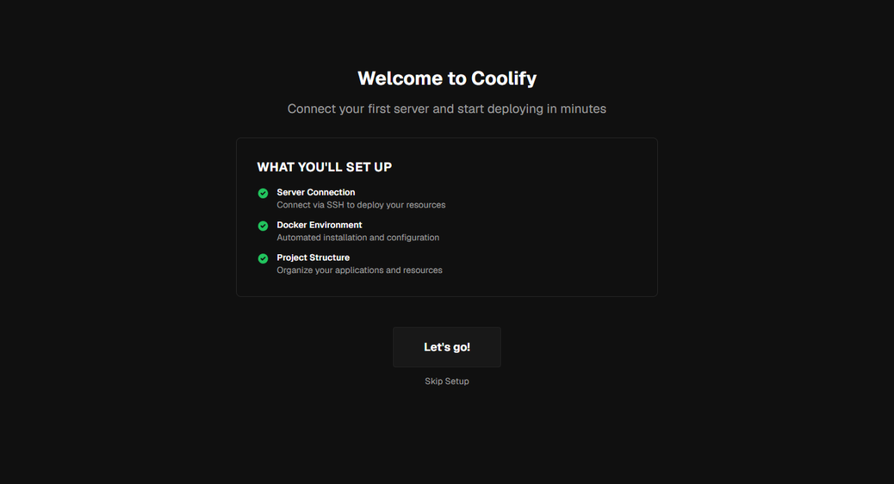
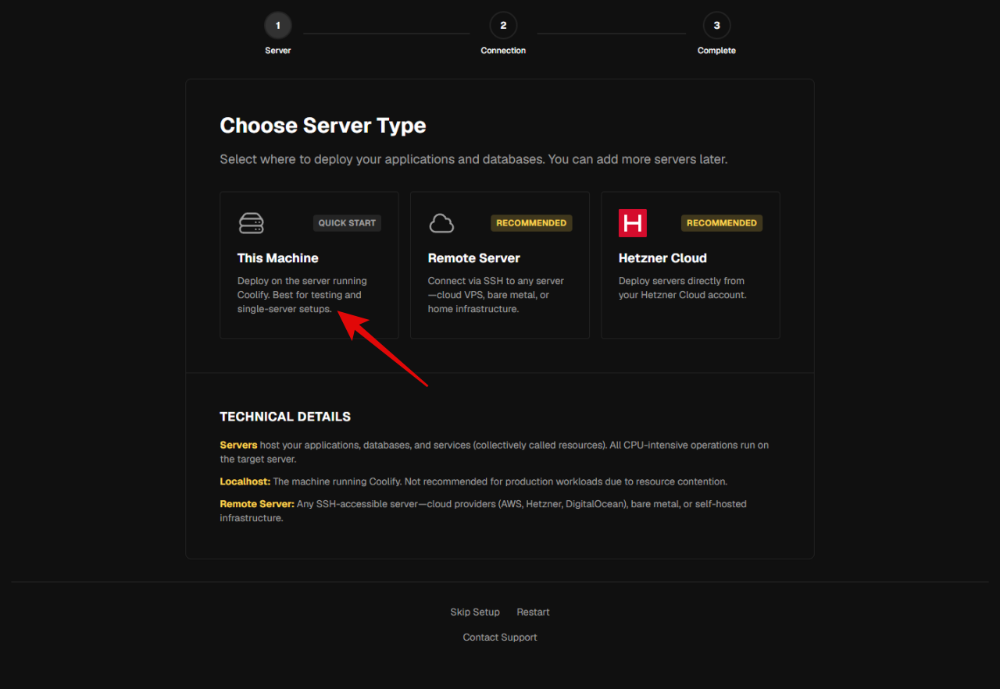
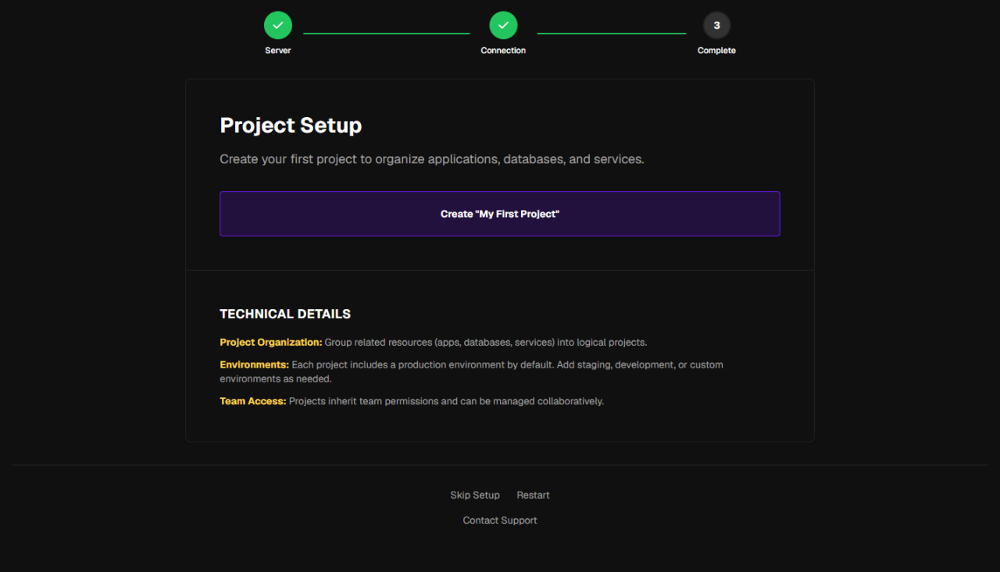
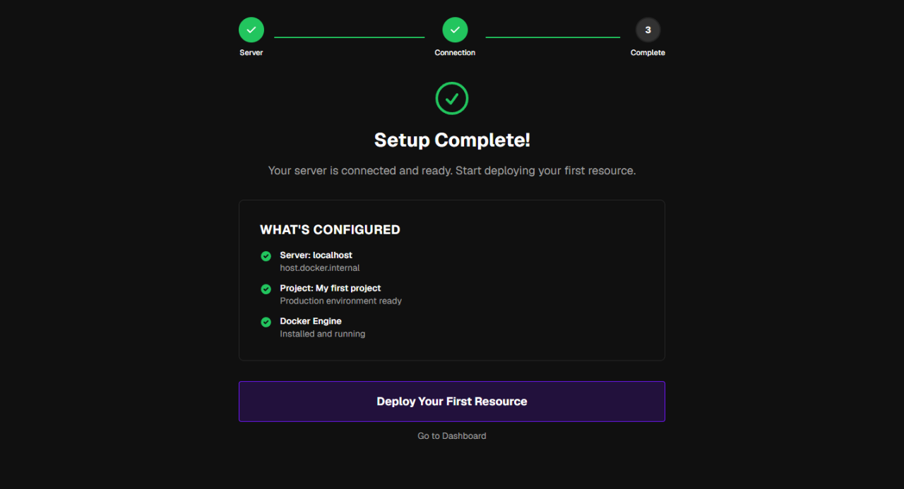

VPS に SSH 接続し、root 権限（または `sudo`）で以下の手順を実行します。

## 1. インストールスクリプトの実行

```bash
curl -fsSL https://cdn.coollabs.io/coolify/install.sh | sudo bash
```

スクリプトが Docker のインストールと Coolify のセットアップを自動で行います。  
完了まで数分かかることがあります。エラーが出た場合は、[[guides/coolify/preparation|インストール準備]] のポート設定を再確認してください。

## 2. 管理者アカウントの設定

インストール後、Coolify の管理画面にアクセスすると、管理者アカウントの作成を求められます。  
任意にユーザ名をつけて、**メールアドレス**、**パスワード**を設定します。

管理画面URL: `http://<VPSのIPアドレス>:8000`

- **メールアドレス** — ログイン用のアカウント
- **パスワード** — 十分な強度のパスワードを設定する





「This Machine」をクリックします。







## 3. 管理画面URLの設定

管理画面のデフォルトのURLではHTTPSでアクセスできません。管理画面のURLをドメイン名に変更しSSL対応にします。  

1. 管理画面に使用するドメイン名(サブドメイン名も可能)をDNSのAレコードに登録します。

2. 管理画面の左サイドメニューのSettingをクリックし、Generalページを表示します。URL項目に`https://`付きでドメイン名を入力します。Generalのタイトルの横の「save」ボタンで設定を保存します。

ブラウザで設定した URL にアクセスし、管理画面が表示されることを確認してください。

## 4. 8000 番ポートを閉じる

管理画面 URL で正常にアクセスできることを確認したら、VPS のファイアウォールから **8000 番ポートを閉じます**。

インストール直後のみ 8000 番でアクセスする必要があり、設定完了後は 80 / 443 経由で利用します。  
不要なポートを開けたままにしないことで、セキュリティリスクを減らせます。

## トラブルシューティング

管理画面にアクセスできない場合、以下を確認してください。

| 確認項目 | 対処 |
| :-- | :-- |
| ファイアウォール | [インストール準備](/guides/coolify/preparation/) のポート（22 / 80 / 443 / 8000）が開いているか |
| インストールログ | スクリプト実行時にエラーが出ていないか |
| DNS | ドメインを使う場合、正しく VPS の IP を指しているか |
| サービス状態 | `docker ps` で Coolify 関連コンテナが起動しているか |

## 完了

Coolify のインストールと初期設定が完了しました。  
次のガイド（ブログサイトの構築など）で、Coolify の基本操作（デプロイ、ドメイン、SSL）を学んでいきます。
