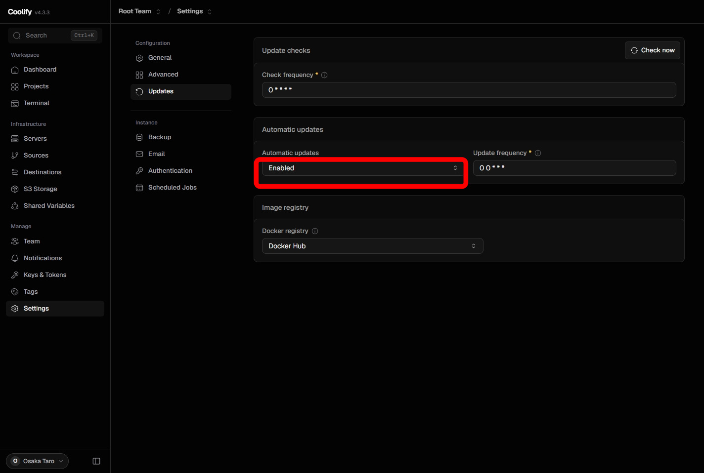

Coolify は、管理画面の設定を有効にしておけば **本体を自動でバージョンアップ** できます。  
ここで扱うのは Coolify 自身の更新であり、デプロイ済みのアプリ（WordPress など）の更新ではありません。

セルフホストでは Automatic updates が最初から有効なことが多いですが、インストール後に一度確認しておくと安心です。

## 自動アップデートを有効にする

1. 管理画面の左メニューで **Settings** をクリックします。
2. **Updates** ページを開きます。
3. **Automatic updates** を **Enabled** にします。

**Enabled** にしておけば、新しいバージョンが利用可能になったときに Coolify が自動でバージョンアップします。

## 関連する設定

同じページには、更新の確認と適用のタイミングを決める項目があります。初心者のうちは既定値のままで問題ありません。

| 項目 | 既定値 | 意味 |
| :-- | :-- | :-- |
| **Check frequency** | `0 * * * *`（毎時） | 新しい Coolify バージョンとサービステンプレートがあるかを確認する間隔 |
| **Update frequency** | `0 0 * * *`（毎日 0:00） | Automatic updates が有効なとき、実際にバージョンアップを適用する時刻 |

Automatic updates を **Disabled** にしても、Check frequency による確認は続きます。手動で上げたいときに新バージョンを知る用途です。

## 補足

- 更新されるのは **Coolify 本体** です。稼働中のアプリやデータベースは、基本的にそのまま動き続けます
- バージョンアップ中は、管理画面が短時間使えなくなることがあります
- GitHub にリリースされても、CDN に反映されてからインスタンスへ届きます。反映まで数時間〜数日かかることがあります

詳しくは公式ドキュメントの [Upgrading Coolify](https://coolify.io/docs/get-started/upgrade) と [Coolify Instance Updates](https://coolify.io/docs/knowledge-base/self-update) を参照してください。

## 次のステップ

[[guides/wordpress/installation|WordPress のインストール]] で、Coolify の基本操作（デプロイ、ドメイン、SSL）を学びましょう。
