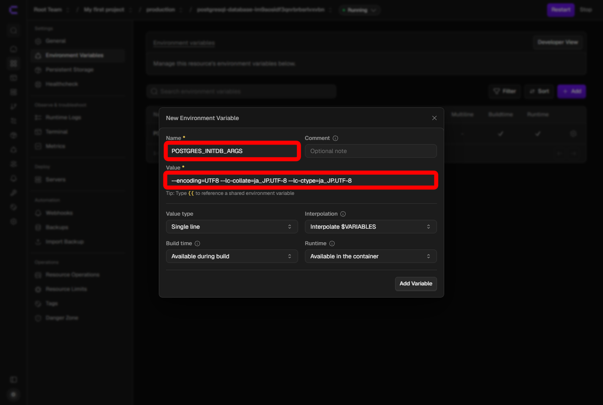
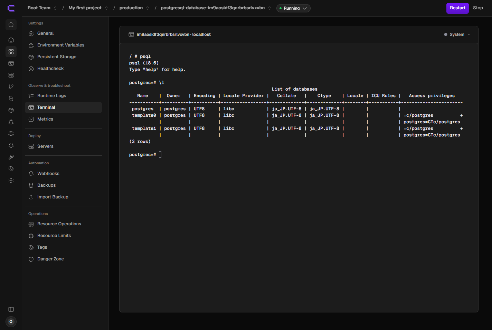

[[guides/coolify/resources|リソースの追加と削除]] で共通操作を確認してから、このページに進みます。

Coolify のデフォルト PostgreSQL には日本語ロケールが入っています。カスタムイメージは作りません。コンテナを初めて起動する前に、環境変数 `POSTGRES_INITDB_ARGS` を設定します。

この設定で決まるのは、次の3つです。

- 文字コード（エンコーディング）— UTF-8
- 照合順序（`LC_COLLATE`）— 文字列の並び順。`ja_JP.UTF-8`
- 文字分類（`LC_CTYPE`）— 文字の種類の判定。`ja_JP.UTF-8`

## 前提条件

- [[guides/coolify/installation|Coolify のインストールと初期設定]] が完了し、管理画面にログインできる
- [[guides/coolify/resources|リソースの追加と削除]] の、追加と起動の流れを把握している

## どの Project に置くか

公開ドメインを持たないデータベースは、それを使うアプリと同じ Project に入れます（[[guides/coolify/concepts|基本的な管理のしくみ]]）。

このページは単体の練習です。アプリがまだ無いときは、専用の Project（例: **PostgreSQL**）を作って、その production に追加して構いません。画面に production と出ていても、そのまま使います。

## 1. PostgreSQL リソースを追加する

1. 追加先の Project を開きます。
2. **Create New Resource**（または **+ New**）をクリックします。
3. **Databases** から **PostgreSQL** を選びます。名前で検索しても見つかります。
4. サーバーと宛先の選択が出たときは、Coolify をインストールしたマシンと、表示された既定の宛先を選びます。
5. **Configuration > General** が開いたら、イメージはデフォルトのままにします。ユーザー名、パスワード、初期データベース名は Coolify が生成した値のままで構いません。

この時点では **Start** を押さないでください。ロケールは、データ領域が作られる最初の起動のときだけ適用されます。

（スクリーンショット予定）

<!--  -->

## 2. 公開しない

**Configuration > General** の **Make it publicly available** はオフのままにします。

同じ宛先ネットワーク上のアプリからは、画面に表示される **Internal URL** で接続します。インターネットへ 5432 番を開けて公開する必要はありません。

## 3. 日本語ロケールを設定する

1. **Configuration** の **Environment Variables** を開きます。
2. 変数を追加します。
   - **Key**（または Name）: `POSTGRES_INITDB_ARGS`
   - **Value**:

     ```text
     --encoding=UTF8 --lc-collate=ja_JP.UTF-8 --lc-ctype=ja_JP.UTF-8
     ```

3. 保存します。



:::caution
すでに一度 **Start** した PostgreSQL では、この環境変数を後から足してもロケールは変わりません。変えるときは、[[guides/coolify/resources|リソースの追加と削除]] の手順でボリュームごと削除し、このページの手順で作り直してください。
:::

## 4. 起動する

1. **Start** をクリックします。
2. 起動の出力を確認し、ステータスが稼働中（healthy）になるまで待ちます。初回はイメージの取得で 1〜2 分かかることがあります。
3. 起動しないときは **Logs** を開き、エラーメッセージを確認します。

## 5. ロケールを確認する

1. リソースの **Terminal** を開きます。
2. 次のコマンドを実行します。

   ```bash
   psql -U postgres -c '\l'
   ```

3. データベース一覧で、次になっていることを確認します。
   - **Encoding** が `UTF8`
   - **Collate** が `ja_JP.UTF-8`
   - **Ctype** が `ja_JP.UTF-8`

ユーザー名を General で変えている場合は、`postgres` の部分をそのユーザー名に読み替えます。



## 次のステップ

[[guides/wordpress/installation|WordPress のインストール]] では、ワンクリックサービスが MariaDB を内包しています。ブログ用に、この PostgreSQL を別に追加する必要はありません。
