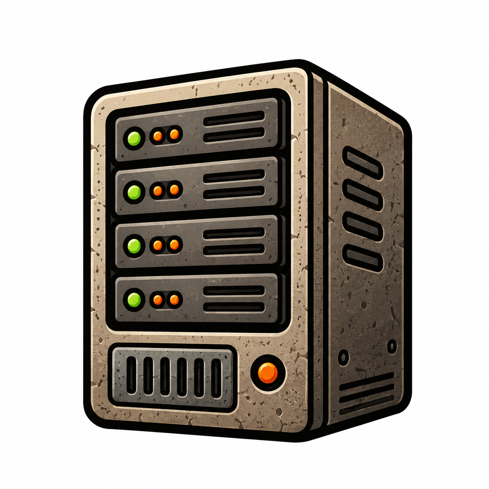

ガイドは、ユーザーが達成したい特定のタスクを順を追って説明するためのページです。
良いガイドを書くには、ユーザーが何をしようとしているかを考えることが大切です。

## サンプル画像

ドキュメント内では Markdown の画像構文で表示できます。

## 参考資料

- [[wiki-links/index|Wiki リンクのテスト]] で wiki 構文のサンプルを確認できます
- [[reference/example|リファレンスのサンプル]] へリンク
- Diátaxis フレームワークの [ハウツーガイドについて](https://diataxis.fr/how-to-guides/) を読む
